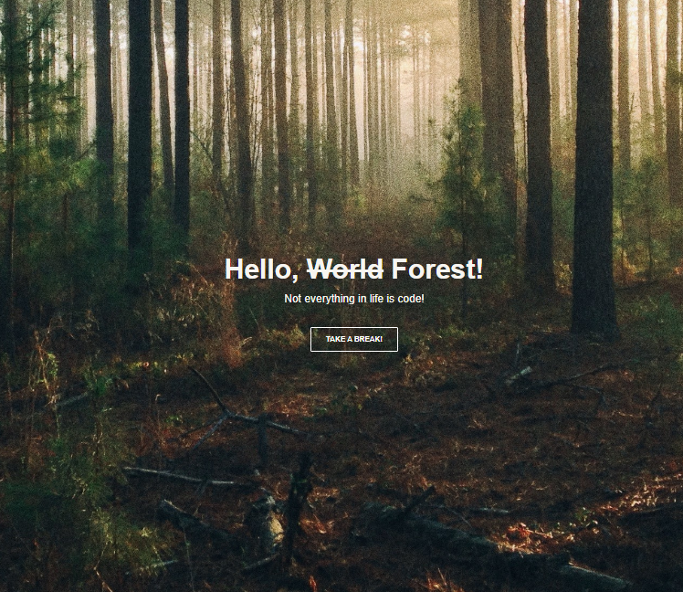

# Ejercicio Flexbox

Este fue un pequeño ejercicio para ir conociendo un poco de Flexbox 

### Características 

**Diseño Responsive:** Adaptable a diferentes tamaños de pantalla, para una experiencia de usuario óptima en dispositivos móviles y de escritorios.

**Intefaz de Usuario Intuitiva:** navegación fácil y accesible.

**Interacciones Dinámicas:** Efectos visuales para elementos interactivos como botones y un enlace que te lleva a una lista de musica relajante en Spotify.

### Tecnologías utilizadas

+ **HTML5:** Para la esctructura básica del sitio.
+ **CSS3:** Para el diseño y el estilo, influyendo _flexbox_ para un diseñor responsivo

### Vista Previa del Proyecto

